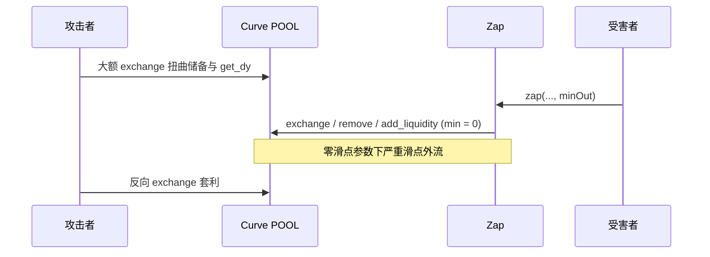

# Zap（yYB）：Curve 池现货定价 + 内部零滑点兑换导致 Zap 路径价值剥离

| 字段 | 内容 |
|------|------|
| **Target** | `0x7d3a6d1085fe898965cbc0b47a5a652965438cac`（Ethereum Mainnet） |
| **Contract** | **`Zap`**（`name = "Zap: yYB"`；多步将 YB / yYB / st-yYB / LP / YBS / veYB 互转） |
| **Severity** | **High** |
| **Category** | Price manipulation / Spot AMM（可操纵 Curve 现货报价） |
| **Reporter** | 赵志杰 |
| **Date** | 2026-05-19 |
| **Status** | Draft |

**语言：** 中文 · [English](../en/eth_0x7d3a6d1085fe898965cbc0b47a5a652965438cac_Zap.md)

---

## Summary

本地址部署的是 **`Zap`** 合约（约 71k 行 verified 工程，**非** QU!D/Rover/Vogue 同栈模板）。合约通过不可变 **`POOL`（Curve）** 在 YB ↔ yYB（`YYB`）及 LP 路径上完成兑换、加池与赎回；定价与路径选择依赖 **`ICurvePool.get_dy` / `calc_withdraw_one_coin` / `get_virtual_price`** 等**瞬时池状态**，无 TWAP 或外部预言机。

用户入口 **`zap(..., minOut, ...)`** 仅在**最终输出**做 `minOut` 校验，但内部多步 Curve 调用将 **`min_dy` / `_min_amount` / `_min_mint_amount` 全部设为 `0`**，等价于 Router **`amountOutMin = 0`** 的「零滑点保护」链。攻击者可在单区块内操纵 Curve 储备，使受害者或协议托管的代币在 **`exchange` / `remove_liquidity_one_coin` / `add_liquidity`** 中以极差汇率成交，再通过反向交易套利。

源码中 **`calcExpectedOut`** 已注明 *"subject to manipulation if used on chain"*，但链上 **`zap` 执行路径并不因此免疫**——中间步骤仍接受任意恶劣成交。

**Etherscan：** https://etherscan.io/address/0x7d3a6d1085fe898965cbc0b47a5a652965438cac

**与已审计合约关系：** 与 `0x1d442…`（Rover）、`0x0bafc…`（Vogue）**源码体量与文件树完全不同**（~71k vs ~703k）；勿套用 Uniswap `slot0` / `getVoguePrice` / `_transfer→swapAndLiquify` 叙事。

---

## Affected scope

| 组件 | 与本地址关系 |
|------|----------------|
| **`Zap`** (`0x7d3a6d…`) | **本报告 Target**；持有对 `POOL`、`YYB`、`YV_YYB`、`LP_YYB`、`YBS` 的无限额 `approve` |
| **`POOL`（Curve）** | `get_dy` / `exchange` / `add_liquidity` / `remove_liquidity_one_coin` 的定价与成交面 |
| **`YYB`（`IYToken`）** | `_convertYb` 在池价不利时走 **`mint(amount, address(this))`**（1:1 铸币分支） |
| **`YV_YYB` / `LP_YYB`** | ERC4626 / Yearn V2 包装；`zap` 进出时依赖 Curve + V2 份额换算 |
| **`YBS`** | `stakeFor` / `unstakeFor`；最终一步有 `minOut`（`amountOut + 1 >= minOut`） |

**Zap 合约内直接受影响函数：**

| 角色 | 函数 |
|------|------|
| 用户入口 | **`zap`** |
| 定价 / 分支 | **`_convertYb`**（`get_dy` 决定 swap vs mint） |
| 火灾现场 | **`_convertToOutput`** → **`_addLiquidity`**；`zap` 内 **`remove_liquidity_one_coin`** |
| 链下报价（可操纵，非执行防护） | **`calcExpectedOut`**、**`relativePrice`** |

---

## Root cause

### 1. 间接清算：Curve 瞬时 `get_dy` / 虚拟价，无抗操纵

Zap **不在合约内**写 `reserve1 * 1e18 / reserve0` 之类公式，但所有 swap/加池/单币赎回的**成交比率**均由 Curve 池当前状态决定。大额同池 `exchange` 可在单区块内扭曲 `get_dy` 与 `get_virtual_price`，使：

- **`_convertYb`** 误判应走 **`exchange(0,1,amount,0)`** 还是 **`YYB.mint`**；
- **`_addLiquidity` / `remove_liquidity_one_coin`** 在严重偏离公允价的曲线上成交。

### 2. 漏洞核心函数（触发源 vs 火灾现场）

> **对照说明：** 税费代币类「`_transfer` → `swapAndLiquify` → `swapExactTokensForTokens` + `addLiquidity`」。**本地址 verified 源码无 `_transfer` / `swapAndLiquify` / `getVoguePrice` / Uniswap `slot0`**。本合约的**经济学同构体**是 **`zap`（触发）→ `_convertYb` + `_convertToOutput`（复合清算）→ 跨合约调用 Curve `POOL`（火灾现场）**。

| 泛化称谓（税费代币 / PM 模板） | 本合约 `Zap.sol` 中的实际实现 |
|-------------------------------|-------------------------------|
| 外层触发 `_transfer` | **`zap`**（`external`；`if` 分支仅选路径，不成交） |
| 内层 `swapAndLiquify`（先 Swap 再 Add Liquidity） | **`_convertYb`** + **`_convertToOutput`**（先 `exchange` / `remove` 再 `add_liquidity` + V2 `deposit`） |
| `swapExactTokensForTokens`（`amountOutMin = 0`） | **`ICurvePool.exchange(i, j, dx, 0)`** |
| `addLiquidity`（`amountAMin` / `amountBMin = 0`） | **`ICurvePool.add_liquidity(_amounts, 0, ...)`** |
| 单币撤出无下限 | **`ICurvePool.remove_liquidity_one_coin(..., 0, ...)`** |

#### 2.1 触发源：`zap` — 控制流 `if` 只负责路由，不负责滑点保护

下列片段体现：**`if (inputToken == YB)` 等条件跳转只是触发源**，真正把用户/协议资产送上 Curve 的是其后调用的 **`_convertYb` / `remove_liquidity_one_coin` / `_convertToOutput`**（跨合约 Sink）。

```solidity
// Zap.sol — zap（约 1001–1058 行）：触发源 — 仅路由与末端 minOut
function zap(
    address inputToken,
    address outputToken,
    uint256 amountIn,
    uint256 minOut,
    address recipient
) external returns (uint256) {
    // ...
    if (inputToken == YB) {
        IERC20(inputToken).safeTransferFrom(msg.sender, address(this), amount);
        yybAmount = _convertYb(amount);              // → 火灾现场（见 2.2）
    } else if (inputToken == LP_YYB) {
        uint256 lpAmount = IV2Vault(LP_YYB).withdraw(amount, address(this));
        yybAmount = ICurvePool(POOL).remove_liquidity_one_coin(
            lpAmount, int128(1), 0, address(this)); // → 火灾现场（见 2.3）
    }
    // ... 其他 inputToken 分支 ...
    return _convertToOutput(outputToken, yybAmount, minOut, recipient); // → 2.4
}
```

**说明（勿与税费代币混淆）：** 上表 `if` **不是**漏洞本体；本体在 **`_convertYb` + `_convertToOutput` 这一跨合约复合业务**内部——其调用的 Curve **`exchange` / `add_liquidity` / `remove_liquidity_one_coin`** 的滑点保护参数（`min_dy` / `_min_mint_amount` / `_min_amount`）在源码中被**硬编码为 `0`**，等价于 Router 的 `amountOutMin = 0` 与 Uniswap `addLiquidity` 的 `amount*Min = 0`。`minOut` 仅校验**最终** `outputToken`，**无法**约束中间 Curve 成交。

#### 2.2 火灾现场 A：`_convertYb` — 复合清算第一步（Swap，跨合约 `POOL`）

路径选择比较 **`get_dy(0,1,amount)`** 与 **`amount + mintBuffer`**（默认 15 bps）；满足条件则池内兑换，但 **`min_dy = 0`**：

```solidity
// Zap.sol — _convertYb（约 1067–1076 行）
function _convertYb(uint256 amount) internal returns (uint256) {
    uint256 outputAmount = ICurvePool(POOL).get_dy(0, 1, amount);
    uint256 bufferedAmount = amount + (amount * mintBuffer / 10_000);

    if (outputAmount > bufferedAmount) {
        return ICurvePool(POOL).exchange(0, 1, amount, 0);  // ← min_dy = 0
    } else {
        IYToken(YYB).mint(amount, address(this));
        return amount;
    }
}
```

攻击者可临时拉高/压低 `get_dy`，迫使受害者走 **高滑点 `exchange`** 或 **非市场价的 `mint` 分支**（与池子真实公允价脱节）。

> **本质说明：** `_convertYb` 内部的 **`ICurvePool.exchange(0, 1, amount, 0)`** 将 **`min_dy` 硬编码为 0**；在 Curve 储备被操纵后，该调用等价于 **`swapExactTokensForTokens` 且 `amountOutMin = 0`**，被迫按被污染的瞬时曲线成交。

#### 2.3 火灾现场 B：`zap` 内 LP 赎回 — 单币撤出零下限

```solidity
// Zap.sol — zap 内 LP_YYB 输入分支（约 1043–1045 行）
uint256 lpAmount = IV2Vault(LP_YYB).withdraw(amount, address(this));
yybAmount = ICurvePool(POOL).remove_liquidity_one_coin(
    lpAmount, int128(1), 0, address(this));  // ← _min_amount = 0
```

在 Curve 池 **`get_virtual_price` / 储备比率异常扭曲** 时，单币赎回可换回**极少** yYB，而 Zap 不在此步 revert。

#### 2.4 火灾现场 C：`_convertToOutput` → `_addLiquidity` — 复合清算第二步（Add Liquidity）

```solidity
// Zap.sol — _convertToOutput 输出 LP_YYB 路径（约 1112–1118 行）
uint256[] memory amounts = new uint256[](2);
amounts[0] = 0;
amounts[1] = amount;
uint256 lpTokens = _addLiquidity(amounts);           // add_liquidity(..., 0)
amountOut = IV2Vault(LP_YYB).deposit(lpTokens, recipient);

// Zap.sol — _addLiquidity（约 1084–1086 行）
function _addLiquidity(uint256[] memory _amounts) internal returns (uint256) {
    return ICurvePool(POOL).add_liquidity(_amounts, 0, address(this));
}
```

> **本质说明：** `_convertToOutput` 在输出 `LP_YYB` 时，先经 **`_addLiquidity` 跨合约调用 Curve**，其 **`_min_mint_amount` 硬编码为 `0`**，再存入 Yearn V2 金库；等价于税费代币报告中的 **`addLiquidity` 且 `amountAMin` / `amountBMin = 0`**，在扭曲曲率下贱配进池。

**结论：** 外层 **`zap` 的 `if` 分支**只负责在**已被操纵的 `get_dy` / 虚拟价**上打开开关；**资金实质流失**发生在 **`_convertYb` 的 `exchange(...,0)`**、**`remove_liquidity_one_coin(...,0)`** 与 **`_addLiquidity(...,0)`** 的组合中（跨合约 Sink：`POOL`）。

#### 2.5 视图函数自述风险（不构成链上防护）

```solidity
// Zap.sol — calcExpectedOut（约 1125–1127 行）
/**
 * @dev This function is for off-chain use only. It is subject to manipulation if used on chain.
 */
```

集成方若用 `calcExpectedOut` 推算 `minOut` 仍无法在**中间 Curve 步骤**阻止同区块操纵。

---

## 攻击路径演练

**前提：** 攻击者可闪电贷操纵 Zap 绑定的 **`POOL`（Curve）** 储备；`zap` 为 **public**，任意账户可触发完整清算链。

### 第 1 步：准备

监听 **`Zap.zap`** 大额进出（尤其 `inputToken == YB` 或 `LP_YYB`、输出 `LP_YYB`），或集成方批量路由交易；可选结合 `calcExpectedOut` 链下报价与链上实际路径的偏差。

### 第 2 步：污染 AMM 瞬时储备（砸盘 / 拉盘）

攻击者向 **`Zap.POOL`（Curve）** 大额 `exchange`，改变池内瞬时储备，使后续结算采用的兑换比率被污染。

**重要表述：** 本合约**源码中并未**显式编写 `price = (reserve1 * 1e18) / reserve0`。财务结果来自：

1. **`ICurvePool.get_dy` / `get_virtual_price` / `calc_withdraw_one_coin`** 读取**瞬时池状态**（与储备比例单调对应，属**间接**定价）；  
2. **`exchange` / `remove_liquidity_one_coin` / `add_liquidity`** 在 **最小输出参数 = 0** 时，按 Curve 当前曲线上的**瞬时兑换比率**成交。

操纵后，池内用于定价的隐含比率可 **严重偏离 / 异常扭曲** 公允市场（可极端偏低或偏高）。**禁止**使用「瞬间**安全**偏离」等表述——应为 **严重偏离 / 恶意扭曲 / 异常扭曲**。

> **与税费代币报告的区分：** 本地址 **无** `_transfer` → `swapAndLiquify` → `swapExactTokensForTokens`；**无** 收纳 Tax/Liquidity Fee 后再自动换币的流程。受害现场是 **Zap 多步 yYB 清算路径上的 Curve 零滑点成交**，见第 3–4 步。

### 第 3 步：间接清算 + 零滑点 Curve 调用（单区块原子性）

这是 **间接清算型** 价格操纵：合约通过 **外部 Curve `POOL`** 完成兑换与加/减池，在 **原生代码层面对 `min_dy` / `_min_amount` / `_min_mint_amount` 未做有效防御（均为 `0`）**，从而在污染比率下被迫成交。

**受害的具体路径（非泛化「transfer / fee pool」）：**

| 步骤 | 实际函数 | 流失资产 |
|------|----------|----------|
| 触发 | **`zap`**（`if` 路由 + 末端 `minOut`） | 读被污染的 `get_dy` / 虚拟价后进入内部清算 |
| 火灾现场 A | **`_convertYb` → `POOL.exchange(..., min_dy=0)`** | 用户 YB / 中间 yYB 在 Curve 上 **滑点流失** |
| 火灾现场 B | **`zap` 内 `remove_liquidity_one_coin(..., 0)`** | LP 赎回 yYB 时 **单币撤出滑点流失** |
| 火灾现场 C | **`_convertToOutput` → `_addLiquidity(..., 0)` → `LP_YYB.deposit`** | yYB **贱配进 Curve + V2 份额** |

**物理过程（与 `swapAndLiquify` 仅经济学同构）：**

1. **抢跑**污染 `POOL` 储备 → `get_dy` 极差。  
2. **受害 tx** 进入 **`zap` → `_convertYb` / `_convertToOutput`**：  
   - 阶段一：**`exchange` 且 `min_dy=0`** 或 **`remove_liquidity_one_coin` 且 `_min_amount=0`**，被迫按污染比率换出极少 yYB；  
   - 阶段二：**`add_liquidity` 且 `_min_mint_amount=0`**，剩余 yYB 以错误曲率注入 LP。  
3. **Slippage Revenue**：攻击者在**同一区块**内反向 `exchange` 套利。

**原子性：** 污染池子、触发 `Zap` 路径、反向套利，可压在 **同一 `block.number`** 内完成。

### 第 4 步：业务层收割与还原

**业务层收割（本合约受害现场）：** 由于 Zap 引用的 Curve 瞬时报价发生 **严重的资产估值失真**，在 **`zap` 触发的多步清算复合体**（`_convertYb` + `_convertToOutput`，跨合约 `POOL`）中，**Curve 池上的 exchange / 单币赎回 / 加池** 在 **零滑点保护参数** 下产生 **严重的滑点差额资金外流**——表现为用户换得的 **yYB / `LP_YYB` / `YV_YYB` 份额** 低于公允价值，差额由攻击者同块反向成交提取。

**还原：** 反向 `exchange` 恢复 `POOL` 曲线，偿还闪电贷，保留 **Slippage Revenue** 净利润。



**与 Rover 报告差异：** Rover 为 Uniswap V3 **`slot0` + Router `exactInput(0)` + NFPM mint(0,0)**；本合约为 **Curve `get_dy` + `exchange`/`add_liquidity`/`remove_liquidity_one_coin` 的 0 下限参数**。

---

## 资金外流受灾函数（已验证源码）

| 函数 | 源文件（约行） | 资金后果 |
|------|----------------|----------|
| **`Zap.zap`** | `src/Zap.sol` ~1001 | 入口；`if` 路由后进入跨合约清算 |
| **`Zap._convertYb`** | ~1067 | `get_dy` 分支 + **`exchange(...,0)`** 或 **`YYB.mint`** |
| **`Zap._convertToOutput`** | ~1098 | 输出 LP 时串联 **`_addLiquidity(...,0)`** |
| **`Zap._addLiquidity`** | ~1084 | **`add_liquidity` 零 `min_mint`** |
| **`calcExpectedOut` / `relativePrice`** | ~1133 / ~1183 | 链下报价；**非**执行期防护 |

**典型损失机制：** 操纵 `POOL` → 受害 `zap` → **`exchange`/`remove`/`add` 全零下限** → 同块反向套利。

---

## Impact

| 影响对象 | 后果 |
|----------|------|
| 调用 **`zap`** 的用户 | 中间步骤以极差汇率换入/换出 yYB 或 LP，实际到手低于公允 `minOut` 所隐含的假设（或交易失败被抢跑） |
| 集成方 / 前端 | 依赖 **`calcExpectedOut` / `relativePrice`** 的报价在同区块内失效 |
| **`Zap` 合约余额** | 异常路径下可能滞留 dust 或成为套利垫片（`sweep` 仅 owner 可取） |

**可利用性（PM 审计摘要）：** `pm_likelihood_tier=极高`，`exploit_probability_pct=80`，`pm_vuln_count=9`（`spot_amm_reserve_math`、`custom_price_function` 等）。

---

## Proof of concept（思路级）

1. 定位链上 **`POOL`**、`YB`、`YYB` 地址（constructor 不可变参数，Etherscan Read Contract）。
2. Fork 主网；对 **`POOL`** 执行大额 `exchange` 使 `get_dy(0,1,Δ)` 相对 `Δ + mintBuffer` 翻转或极端偏离。
3. 调用 **`zap(YB, LP_YYB, amount, minOut, recipient)`** 或 **`zap(LP_YYB, YYB, ...)`**，观察内部 **`exchange(...,0)`** / **`remove_liquidity_one_coin(...,0)`** 输出相对未操纵 fork 的损失。
4. 同区块反向 `exchange` 验证净利润 > gas + 闪电贷费。

（完整 Foundry 脚本可按实际 `POOL` 类型 stable/crypto 选用对应 `exchange` 重载。）

---

## Recommendations

1. **Curve 调用：** 为 **`exchange`**、**`add_liquidity`**、**`remove_liquidity_one_coin`** 传入基于 **TWAP、链下预言机或用户 `minOut` 反推的中间下限**，而非 `0`。
2. **`_convertYb`：** 勿仅用单点 **`get_dy`** 与固定 **`mintBuffer`** 分支；应使用 TWAP 比价或强制用户指定 **`minYYB`**。
3. **`zap`：** 增加 **每跳 `minOut`** 或 **统一 slippage bps** 参数，在中间状态变化时 revert。
4. **文档：** 禁止链上依赖 **`calcExpectedOut` / `relativePrice`** 做清算；前端应标注 Curve 操纵风险。
5. **监控：** 对 `POOL` 大额 swap 与 `Zap.zap` 同窗关联告警。

---

## 第二部分：Datalog 规则优化（静态分析 / PM 检测）

为提升对本类 **Zap / 路由型清算合约** 的召回与误报控制，建议在 Datalog 规则中采用下列**规范静态分析术语**（替代口语化「条件跳转 → 内部私有块」描述）：

| 原口语表述 | 规范术语（建议写入规则注释） |
|------------|------------------------------|
| 条件跳转后进入内部函数 | **Control-flow branch（谓词边）→ Intra-procedural internal callee** |
| 内部函数里又有外部调用 | **Internal composite block → Inter-contract call edge（External Sink）** |
| `swapAndLiquify` 一类复合模式 | **Tainted-price-guided composite sink**：`PricingRead(get_dy \| slot0 \| getPrice)` **支配** `ExternalCall(exchange \| exactInput \| add_liquidity \| mint)`，且 **SlippageArg = 0** |
| 只命中 `_transfer` 的 `if` | **Trigger-only match（误报源）**；应 **向上追溯 Post-dominator** 至含 **跨合约 Sink** 的复合块 |
| 税费 / Fee Pool 关键词 | **Pattern-specific sink**（`TaxLiquidityPool`）；对 **Zap** 应映射为 **`CurvePoolSink`** + **`ZeroMinOutArg`**，**勿**强制绑定 `_transfer` |

**推荐规则骨架（概念级）：**

```text
rule zap_curve_zero_slippage_sink:
  // Control-flow: external entry
  Entry(zap, "zap") &
  // Branch is trigger only (do not report here)
  BranchPredicate(inputToken, _) &
  // Data-flow: spot/oracle read taints amount path
  TaintedPricingRead(POOL, {get_dy, get_virtual_price, calc_withdraw_one_coin}) &
  // Sink: inter-contract call with zero min-out
  ExternalSink(ICurvePool, {exchange, add_liquidity, remove_liquidity_one_coin}) &
  HardcodedZero(SlippageArg) &
  // Composite: same transaction as _convertYb / _convertToOutput cluster
  PostDominatedBy(InternalBlock, {"_convertYb", "_convertToOutput"})
  => Vuln("indirect_settlement_zero_slippage", High)
```

**与本次命中对齐：** PM 元数据 `spot_amm_reserve_math`、`custom_price_function`、`router_swap_code`（泛化）应 **降级** 为对 **`ICurvePool.*` + `min_* = 0`** 的 **Sink 级** 匹配，避免仅因 `zap` 内 `if (inputToken == …)` 产生 **Trigger-only** 告警。

---

## References

- 本地 verified 源码：`pm_audit_tier_high_and_extreme/eth_0x7d3a6d1085fe898965cbc0b47a5a652965438cac.txt`
- PM 元数据：`eth_0x7d3a6d1085fe898965cbc0b47a5a652965438cac.meta.txt`
- 同栈对比（**不同代码库**）：`../en/eth_0x1d442eeed53b89f08a5b07a256a9d0fa99bc1f97_Rover.md`、`Vogue.md`

---

## Disclosure timeline

| 日期 | 事件 |
|------|------|
| 2026-05-19 | 基于 PM 扫描 + 源码审计起草 |
| （待填） | 厂商联系 |
| （待填） | 修复验证 |
