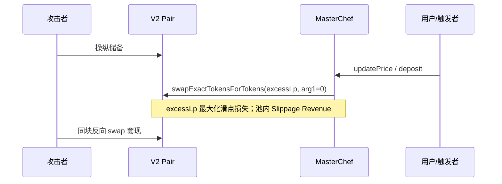

# MasterChef（SushiMasterChef）：多余 LP 零滑点 Router 兑换可被 AMM 储备操纵

| 字段 | 内容 |
|------|------|
| **Target（主实例）** | `0x7f6229786703f01a8bfcede5f94c36179c467acd`（Ethereum Mainnet） |
| **同构部署** | **`0xdae1acc21ed8e26beb311edeb70e1ae5e27e8a0b`**（见下表） |
| **Contract** | **`MasterChef`**（`contracts/yzz/SushiMasterChef.sol`；LP 质押挖矿 + 邀请/基金分润） |
| **Severity** | **High** |
| **Category** | Price manipulation / Spot AMM（Uniswap V2 瞬时储备） |
| **Reporter** | 赵志杰 |
| **Date** | 2026-05-19 |
| **Status** | Draft |

**语言：** 中文 · [English](../en/eth_0x7f6229786703f01a8bfcede5f94c36179c467acd_MasterChef.md)

---

## Summary

本地址部署的是 **`MasterChef`**（约 1.1k 行单文件 verified 工程，**非** QU!D/Rover/Vogue/Zap 模板）。合约用内部参数 **`powerPerPrice`**（随时间单调上调）在 LP 与「算力」`user.amount` 之间记账；**与价格操纵相关的致命链**在于 **`reward()`**：当池内 LP 余额超过按 `powerPerPrice` 核算的赎回负债时，将 **`excessLp`** 经 **Uniswap V2 Router** 换成奖励代币 `token`，且 **`amountOutMin = 0`**。

攻击者可在 **`reward()` 执行前** 操纵 V2 路径上配对池的瞬时储备，使协议以极差汇率卖出多余 LP，换得的奖励代币减少，进而 **`accSushiPerShare` 被低估**、全体质押者应得奖励被稀释；攻击者同区块反向套利。触发可由任意人调用 **`updatePrice`**（每 5 分钟调一次 **`reward`**），或用户 **`deposit` / `withdraw`** 间接触发。

**Etherscan（主实例）：** https://etherscan.io/address/0x7f6229786703f01a8bfcede5f94c36179c467acd

---

## 已验证部署实例（MasterChef 组件）

| 地址 | 与 `0x7f622…` 关系 | 说明 |
|------|-------------------|------|
| **`0x7f6229786703f01a8bfcede5f94c36179c467acd`** | **主实例** | 本报告全文 |
| **`0xdae1acc21ed8e26beb311edeb70e1ae5e27e8a0b`** | **逻辑同构**（归一化后约 23 行差异） | `reward()` → **`swapExactTokensForTokens(..., 0)`** 未变；差异在 `updatePrice` 时间判断、邀请奖励走 `token.reward` 等；[Etherscan](https://etherscan.io/address/0xdae1acc21ed8e26beb311edeb70e1ae5e27e8a0b) |

**指纹结论：** 与主实例属同一 **SushiMasterChef** 业务与 **零滑点 `reward` 清算** 类；**无需另写报告**，提交时替换 Target 地址即可。

**源码：** `Etherscan verified source (see contract address above)`

---

**审计结论：** **存在** 可 exploitable 的间接清算型价格操纵（Router 零滑点）；`powerPerPrice` 本身为链上时间函数，**不能**被闪电贷直接扭曲，**不**构成主要攻击面。

**PM 摘要：** `pm_likelihood_tier=高`，`exploit_probability_pct=70`，`pm_vuln_count=13`，`audit_notes` 含 `path_explosion_possible_fp` 与 `FP:router_swap_code`——本报告将 **`reward` → `swapExactTokensForTokens(..., 0)`** 定为 **Sink 级** 真实命中，而非仅 Router 接口存在。

---

## Affected scope

| 组件 | 与本地址关系 |
|------|----------------|
| **`MasterChef`** (`0x7f622…`) | **本报告 Target**；托管各池 `lpToken`，对 Router 无限 `approve` |
| **`uniswapRouter`** | `0x7a250d5630B4cF539739dF2C5dAcb4c659F2488D`（V2） |
| **`buyToken`** | 默认 **USDT**（`0xdAC17F958D2ee523a2206206994597C13D831ec7`）；非直连池时的中间币 |
| **`token`** | 奖励 ERC20；`reward()` 买入后用于更新 **`accSushiPerShare`** |
| 各池 **`lpToken`** | 用户 `deposit` 存入；`excessLp` 卖出标的 |

**直接受影响函数：**

| 角色 | 函数 |
|------|------|
| 公开触发 | **`updatePrice`**、`deposit`、`withdraw`、`takerWithdraw` |
| 复合清算 | **`reward`**（计算 `excessLp` → Router 兑换） |
| 火灾现场 | **`IUniswapV2Router02.swapExactTokensForTokens(..., amountOutMin: 0)`** |
| 非 PM 主风险 | **`powerPerPrice` / `updatePrice` 折旧公式**（时间驱动，非 AMM 现货） |

---

## Root cause

### 1. 间接清算：V2 `getAmountsOut` 隐含储备比，合约未校验

合约**未**调用 `getAmountsOut` 设置下限，卖出 `excessLp` 时完全依赖 Router 在**当前储备**下的成交比例（与 `reserve0/reserve1` 单调相关，属**间接定价**）。大额 V2 swap 可在单区块内使该比例 **严重偏离 / 异常扭曲** 公允市场。

### 2. 漏洞核心函数（触发源 vs 火灾现场）

> **对照说明：** 本合约 **无** `_transfer` / `swapAndLiquify` / `addLiquidity` / Curve `slot0`。**经济学同构体**为：**`deposit`/`withdraw`/`updatePrice`（触发）→ `reward`（复合清算）→ Router `swapExactTokensForTokens`（火灾现场）**。

| 泛化称谓（税费代币 / PM 模板） | 本合约 `SushiMasterChef.sol` 中的实际实现 |
|-------------------------------|------------------------------------------|
| 外层触发 `_transfer` | **`deposit` / `withdraw` / `updatePrice`**（`if` 与时间门控仅决定是否调用 `reward`） |
| 内层 `swapAndLiquify`（复合业务） | **`reward`**：算 `excessLp` → 再 Swap（**无** Add Liquidity 步骤） |
| `swapExactTokensForTokens`（`amountOutMin = 0`） | **`uniswapRouter.swapExactTokensForTokens(excessLp, 0, path, ...)`** |
| `addLiquidity` | **不适用**（本合约不加池） |

#### 2.1 触发源：`updatePrice` / `deposit` — 条件与时间门控，非成交本体

```solidity
// SushiMasterChef.sol — updatePrice（约 886–904 行）：触发源
function updatePrice(uint256 _pid) public {
    if (block.timestamp - lastPriceUpdateTime < 300) return;
    // ... powerPerPrice 按时间上调（内部记账，非 AMM）...
    PoolInfo storage pool = poolInfo[_pid];
    if (block.timestamp - pool.lastRewardTime >= 300) {
        reward(_pid);   // → 火灾现场（见 2.2）
    }
}

// deposit（约 928–932 行）同样先 updatePrice(_pid)
function deposit(uint256 _pid, uint256 _amount) public {
    // ...
    updatePrice(_pid);
    // ... LP 入账、powerAmount 记账 ...
}
```

**说明：** `if (block.timestamp - ... < 300) return` 等分支**只是触发源**；资金实质流失在 **`reward` 内对 `excessLp` 的 Router 兑换**。

#### 2.2 火灾现场：`reward` — `swapExactTokensForTokens` 滑点参数硬编码为 0

> 以下代码摘录已将 Etherscan verified 源码中的繁体注释统一译为**简体**，与全文及内地漏洞库（如 CNVD）表述一致。

```solidity
// SushiMasterChef.sol — reward（约 1094–1132 行）
function reward(uint256 _pid) public {
    PoolInfo storage pool = poolInfo[_pid];
    uint256 balance = pool.lpToken.balanceOf(address(this));
    uint256 totalRefundBalance = (pool.totalPower * pool.decimals) / powerPerPrice;

    uint256 excessLp = 0;
    if (balance > totalRefundBalance) {
        excessLp = balance - totalRefundBalance;
    }

    if (excessLp > 0 && address(uniswapRouter) != address(0)) {
        // ... 构造 path: lpToken → [buyToken] → token ...
        uint256[] memory rewardAmounts = uniswapRouter.swapExactTokensForTokens(
            excessLp,
            0,   // ← amountOutMin = 0，接受任意数量的输出
            swapPathToUse,
            address(this),
            block.timestamp + 300
        );
        totalRewardTokensBought = rewardAmounts[rewardAmounts.length - 1];
    }

    if (totalRewardTokensBought > 0 && pool.totalPower > 0) {
        pool.accSushiPerShare = pool.accSushiPerShare.add(
            totalRewardTokensBought.mul(1e12).div(pool.totalPower)
        );
        // ...
    }
}
```

> **本质说明：** 漏洞本体是 **`reward` 内部** 跨合约调用 Uniswap V2 Router 时，**`amountOutMin` 被硬编码为 `0`**。在配对池储备被操纵后，该调用被迫按**被污染的瞬时兑换比率**卖出 `excessLp`，换得的 **`token` 显著减少**，全体质押者 **`accSushiPerShare` 增幅偏低**，差额被攻击者同块套利抽走。

**结论：** 外层 **`deposit`/`updatePrice` 的 `if`** 只负责定时打开 `reward`；**协议资金与质押奖励的实质损失**发生在 **`swapExactTokensForTokens(..., 0)`** 这一 **External Sink**。

### 3. `powerPerPrice` 与操纵面区分（避免误报）

- **`powerPerPrice`** 仅由 **`updatePrice`** 按 `depreciationPerDayBps` 与时间差**单调递增**，用于 LP↔算力换算，**不读取** AMM 储备。  
- 攻击者**不能**用闪电贷直接篡改 `powerPerPrice`。  
- **主要可利用面**仍是 **`reward()` 对 `excessLp` 的 V2 零滑点卖出**。

---

## 攻击路径演练

**前提：** 攻击者可闪电贷操纵 **`lpToken`–`buyToken`–`token`** 路径涉及的 V2 池储备；**`updatePrice` / `reward` 为 public**，可被抢跑编排。

### 第 1 步：准备

监听目标池 **`RewardDistributed`**、大额 **`deposit`**，或距上次 `pool.lastRewardTime` ≥ 300s 的窗口；确认链上存在 **`excessLp > 0`**（`balance > totalRefundBalance`）。

### 第 2 步：污染 AMM 瞬时储备

在 **`lpToken/token`（或经 USDT 中转）** 的 V2 池上大额 `swap`，使 Router 隐含兑换比率 **严重偏离 / 异常扭曲** 公允价。

**表述规范：** 本合约**未**显式编写 `price = reserve1 * 1e18 / reserve0`；结果来自 Router 按**瞬时储备**成交。**禁止**「瞬间安全偏离」——应写 **严重偏离 / 恶意扭曲**。

> **与税费代币区分：** 无 `_transfer` → Tax/Liquidity Fee Pool。受害现场为 **MasterChef 金库内 `excessLp` 的零滑点 Router 卖出**。

### 第 3 步：间接清算 + 零滑点 Router（单区块原子性）

| 步骤 | 实际函数 | 后果 |
|------|----------|------|
| 触发 | **`updatePrice` / `deposit` / `withdraw`** | 满足 300s 门控后进入 **`reward`** |
| 火灾现场 | **`reward` → `swapExactTokensForTokens(..., 0)`** | 合约内 **`excessLp` 最大化滑点损失** |
| 下游 | **`accSushiPerShare` 更新** | 全体质押者 **`pendingSushi` 被稀释** |
| 攻击者闭环 | **同块反向 V2 `swap`** | 外部 AMM 池内 **Slippage Revenue** 原位变现 |

**物理过程：**

1. **抢跑**污染 V2 储备。  
2. **受害/触发 tx** 调用 **`reward`**（直接或通过 **`updatePrice`**）。  
3. Chef 以 **`amountOutMin = 0`**（`swapExactTokensForTokens` 第 2 实参）卖出 `excessLp`，大额沉淀 LP 被迫兑换为**极其微量**的奖励代币——**导致合约内沉淀的 `excessLp` 发生最大化滑点损失**，并在外部 AMM 资金池中原位转化为可被套现的 **滑点差额收入（Slippage Revenue）**。  
4. **同块反向 swap** 完成金融攻击的原子闭环：协议与质押者承担损失，攻击者提取价差。

### 第 4 步：业务层收割与还原

**业务层收割（本合约受害现场）：** 由于 **`reward` 引用的 Uniswap V2 瞬时报价发生严重的资产估值失真**，在 **`excessLp` 自动回购奖励代币** 的路径上，**`amountOutMin`（第 2 实参）为零** 导致合约内沉淀的 **`excessLp` 最大化滑点损失**；该损失在外部 AMM 资金池中原位转化为攻击者可套现的 **Slippage Revenue**，表现为协议换得的 **`token` 少于公允值**、全体质押者 **`accSushiPerShare` 增幅不足**。

**还原：** 反向交易恢复池价，偿还闪电贷。



---

## 资金外流受灾函数（已验证源码）

| 函数 | 源文件（约行） | 资金后果 |
|------|----------------|----------|
| **`MasterChef.reward`** | ~1094 | **`excessLp` → Router，`amountOutMin=0`** |
| **`MasterChef.updatePrice`** | ~886 | 定时触发 **`reward`** |
| **`MasterChef.deposit`** | ~928 | 间接触发 **`updatePrice` → reward`** |
| **`MasterChef.withdraw`** | ~969 | 同上 |
| **`MasterChef._processUserRewardAndFee`** | ~1022 | 分发已铸/已购 **`token`**（间接受 `accSushiPerShare` 影响） |

**典型损失机制：** 操纵 V2 池 → 触发 **`reward`** → 零滑点卖出 `excessLp` → `accSushiPerShare` 偏低 → 同块套利。

---

## Impact

| 维度 | 说明 |
|------|------|
| **Financial** | 质押用户 **`pendingSushi`** 因 `accSushiPerShare` 更新不足而损失；协议 **`excessLp` 被贱卖** |
| **Integrity** | 奖励分配与真实市场回购成本脱节 |
| **Availability** | 不直接停机；可重复利用直至设置非零 `amountOutMin` / TWAP |

**Severity：High** — 无需特权；`reward`/`updatePrice` 公开；`excessLp` 规模随存款增长。

---

## Proof of concept（思路级）

1. Fork 主网，读取目标 `_pid` 的 `lpToken`、`token`、`buyToken` 与 Chef 余额。  
2. 使 `balance(lpToken) > totalRefundBalance`（或等待自然积累 `excessLp`）。  
3. 在 V2 池上闪电贷操纵储备，同一区块调用 **`updatePrice(_pid)`** 或 **`deposit`**。  
4. 对比操纵前后 **`RewardDistributed` 的 `rewardAmount`** 与未操纵 fork 的差值，减去 gas/闪电贷费即为利润上界。

---

## Recommendations

1. **`reward` 中 `swapExactTokensForTokens`**：用 **`getAmountsOut`** + 滑点 bps 设置 **`amountOutMin > 0`**，或 Chainlink/TWAP 底价校验。  
2. **`reward` 访问控制**：考虑仅 **`onlyOwner`** 或时间锁执行，降低被抢跑窗口（不能替代滑点下限）。  
3. **拆分 `updatePrice`**：记账上调与 **`reward` 回购** 解耦，回购前强制链下/链上价格健全性检查。  
4. **监控**：`excessLp` 卖出与 V2 大 swap 同窗关联告警。

---

## 第二部分：Datalog 规则优化（静态分析 / PM 检测）

| 原口语表述 | 规范术语 |
|------------|----------|
| 命中 Router 接口 | **DeclaresRouterInterface** ≠ **Sink**；需 **CallSite** 精确到 selector 与实参下标 |
| `deposit` 内 `if` | **Control-flow branch → Post-dominated External Sink**（`reward` 内 V2 swap） |
| `path_explosion_possible_fp` | 对 **MasterChef** 启用 **CompositeSink("reward")** 剪枝，避免 13 路径爆炸误报掩盖真实 **`amountOutMin = 0`** |

**`swapExactTokensForTokens` 实参索引（与 verified 源码一致）：**

| 下标 | 名称 | 本合约传入 |
|------|------|------------|
| `0` | `amountIn` | `excessLp` |
| `1` | `amountOutMin` | **`0`（Sink：硬编码零）** |
| `2` | `path` | `swapPathToUse` |
| `3` | `to` | `address(this)` |
| `4` | `deadline` | `block.timestamp + 300` |

```text
.rule masterchef_v2_zero_min_out_sink
  EntryPoint("MasterChef", {"deposit", "withdraw", "updatePrice"}) &
  PostDominatedBy(InternalCallee, "reward") &
  ExternalSink(
    CalleeType: "IUniswapV2Router02",
    Selector: "swapExactTokensForTokens(uint256,uint256,address[],address,uint256)",
    ArgIndex(0): TaintedSymbol("excessLp"),
    ArgIndex(1): HardcodedZero
  ) &
  DataFlow(
    excessLp,
    Sub(
      Call("IERC20.balanceOf", pool.lpToken, address(this)),
      Div(
        Mul(pool.totalPower, pool.decimals),
        Load("powerPerPrice")
      )
    )
  )
  -> Vuln("indirect_settlement_router_zero_slippage", severity=High)
```

**符号约定：** `&` 表逻辑与；`->` 表规则结论箭头；字符串与 `Selector` 使用 ASCII 双引号；括号成对闭合。  
**勿**将 **`powerPerPrice` 算术** 单独标为 spot AMM 操纵；应标注为 **InternalAccountingPrice**（时间序列），与 **RouterZeroMinOut** 分桶。

---

## References

- 源码（主实例）：`eth_0x7f6229786703f01a8bfcede5f94c36179c467acd.txt`
- 同构实例：`eth_0xdae1acc21ed8e26beb311edeb70e1ae5e27e8a0b.txt`
- PM 元数据：上述地址均为 MasterChef / 高 / 70% / `pm_vuln_count` 13
- 对比（不同协议）：`../en/eth_0x7d3a6d1085fe898965cbc0b47a5a652965438cac_Zap.md`、`Rover.md`

---

## Disclosure timeline

| 日期 | 事件 |
|------|------|
| 2026-05-19 | PM 扫描 + 源码审计；确认存在 Router 零滑点价格操纵面 |
| （待填） | 厂商联系 |
| （待填） | 修复验证 |
